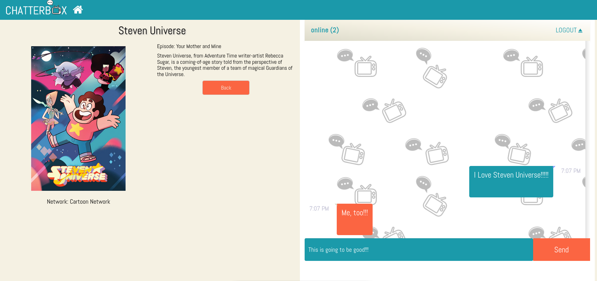
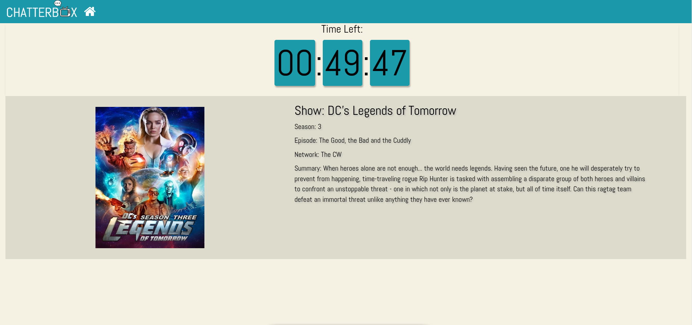

# ChatterBox

Join the Chatter!

Chat about your favorite TV shows!

Connect with other fans!

Be free to be a chatterbox!

## Features

* Chat rooms for new episodes only.
* Chat rooms are only available for the duration of the TV show.
* Chat rooms have a capcity limit.
* Waiting rooms for shows yet to air that day.
* TV schedule with listings of today's new episodes.

Chat Room:

Waiting Page:

TV Schedule:

## Future

* Community Building
    * User Accounts
    * Administrator Roles
* Expanding the Market
    * Mobile App for iOS and Android
    * Partnerships to offer live-streaming of TV shows
    * After-show forums
    * Chat rooms for non-bradcast shows (YouTube shows, Netflix shows)

## Technologies Used

* React JS
* React Bootstrap
* Axios
* Express
* PostgreSQL
* Socket.io
* [TV Maze API](http://www.tvmaze.com/api)

## Installation

1. Clone or download this repository.
2. To run the front end:
    * Open a terminal.
    * `cd client` 
    * `npm start`
3. To run the back end:
    * Open a new terminal. 
    * `cd back-end` 
    * `nodemon` or `npm start`
4. To run the database with PostgreSQL (on Linux):
    * Open a new terminal.
    * `cd back-end/db`
    * `createdb chatterbox1`
    * `sudo service postgresql start`
    * `psql -f tvAPI.sql chatterbox1`
    * `sudo -u postgres psql`
